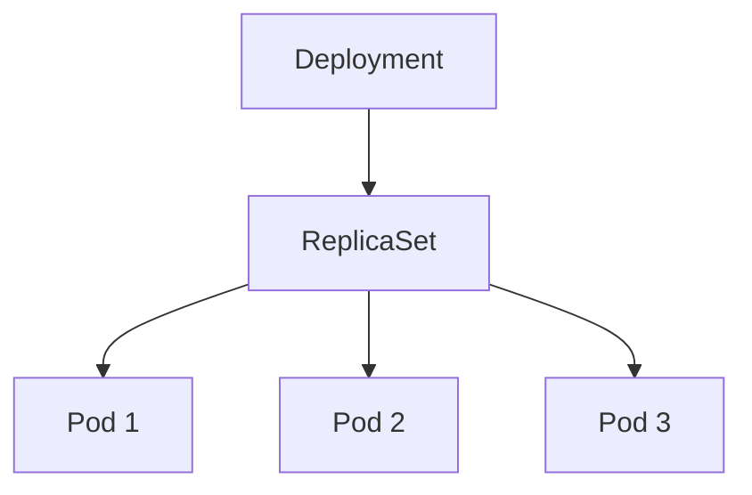
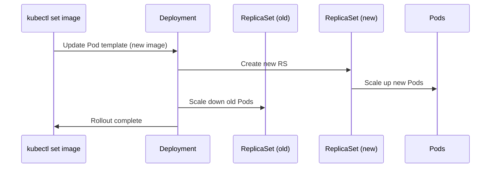

# Kubernetes Guide: Pod, ReplicationController, ReplicaSet, Deployment

> Clean, corrected, and production-minded notes. Everything you need in one file.

---

## Table of Contents
- [Overview](#overview)
- [Repository Structure](#repository-structure)
- [Quick Start Lab](#quick-start-lab)
- [Pod (`pod.yaml`)](#pod-podyaml)
- [ReplicationController (`rc.yml`)](#replicationcontroller-rcyml)
- [ReplicaSet (`rs.yml`)](#replicaset-rsyml)
- [Deployment (`deployment-nginx.yml` and `deploy.yml`)](#deployment-deployment-nginxyml-and-deployyml)
- [Command Cheat Sheet](#command-cheat-sheet)
- [Validated Fixes for Your Earlier Errors](#validated-fixes-for-your-earlier-errors)
- [Troubleshooting & Tips](#troubleshooting--tips)
- [Visual Diagrams](#visual-diagrams)

---

## Overview
এই ডকুমেন্টে **Kubernetes-এর চারটি মূল অবজেক্ট** নিয়ে প্র্যাকটিস নোটস আছে: **Pod, ReplicationController (RC), ReplicaSet (RS), Deployment**।  
সব YAML **validated** ও **corrected**, সাথে রয়েছে কমান্ড চিটশিট, সাধারণ ভুলগুলোর ফিক্স এবং প্রোডাকশন-মনস্ক উদাহরণ।

> ℹ️ নোট: আগের ডক/কমান্ডে থাকা টাইপো ও ভুল যেমন `--dryrun` vs `--dry-run=client`, ভুল container name ইত্যাদি এই গাইডে ঠিক করা হয়েছে।

---

## Repository Structure
Recommended repo layout (copy as you like):
```
.
├── pod.yaml
├── rc.yml
├── rs.yml
├── deployment-nginx.yml     # corrected name (not 'delpoyment-nginx.yml')
└── deploy.yml               # generated by kubectl (minimal)
```

---

## Quick Start Lab
1) **Apply objects** (step-by-step):
```bash
kubectl apply -f pod.yaml
kubectl apply -f rc.yml
kubectl apply -f rs.yml
kubectl apply -f deployment-nginx.yml
```
2) **Verify**:
```bash
kubectl get all -o wide
kubectl describe deploy/nginx-deploy
```
3) **Rolling update & rollback**:
```bash
kubectl set image deploy/nginx-deploy nginx-container=nginx:1.25-alpine
kubectl rollout status deploy/nginx-deploy
kubectl rollout history deploy/nginx-deploy
kubectl rollout undo deploy/nginx-deploy
```

---

## Pod (`pod.yaml`)
Pod হচ্ছে Kubernetes-এর **সবচেয়ে ছোট deployable unit**। টেস্টিংয়ের জন্য ভালো, কিন্তু self-healing/rolling update দেয় না।

### ✅ Corrected YAML (version-pinned, safer defaults)
```yaml
apiVersion: v1
kind: Pod
metadata:
  name: declarative-pod-nginx
  labels:
    app: nginx
    env: demo
    type: frontend
spec:
  containers:
  - name: nginx-container
    image: nginx:1.25-alpine
    imagePullPolicy: IfNotPresent
    ports:
    - containerPort: 80
```

### Useful Pod Commands
| Command | ব্যাখ্যা |
|---------|----------|
| `kubectl apply -f pod.yaml` | Pod তৈরি/আপডেট |
| `kubectl get pods -o wide` | Pod + কোন Node-এ চলছে |
| `kubectl describe pod pod.yaml` | Pod-এর বিস্তারিত |
| `kubectl logs <pod-name>` | কন্টেইনার লগ |
| `kubectl exec -it <pod-name> -- /bin/sh` | কন্টেইনার শেলে ঢোকা |
| `kubectl port-forward pod/<pod-name> 8080:80` | লোকাল 8080 → Pod 80 |
| `kubectl delete pod declarative-pod-nginx` | Pod ডিলিট |

> ⚠️ Tip: Pod মরে গেলে নিজে নিজে ফিরে আসে না। ReplicaSet/Deployment ব্যবহার করো।

---

## ReplicationController (`rc.yml`)
ReplicationController নিশ্চিত করে নির্দিষ্ট সংখ্যক Pod সবসময় চলছে। এটি **legacy**; আধুনিক সময়ে RS/Deployment ব্যবহার করাই ভালো।

### ✅ Corrected YAML (removed invalid `name` in template, pinned image)
```yaml
apiVersion: v1
kind: ReplicationController
metadata:
  name: rc-nginx
  labels:
    app: nginx
    env: demo
spec:
  replicas: 3
  selector:
    app: nginx
    env: demo
  template:
    metadata:
      labels:
        app: nginx
        env: demo
    spec:
      containers:
      - name: nginx-container
        image: nginx:1.25-alpine
        ports:
        - containerPort: 80
```

### RC Commands
| Command | ব্যাখ্যা |
|---------|----------|
| `kubectl apply -f rc.yml` | RC তৈরি/আপডেট |
| `kubectl get rc` | সব RC |
| `kubectl delete rc rc-nginx` | RC ডিলিট |

> ❗ কেন ফিক্স: আগের YAML-এ `template.metadata.name: nginx` থাকলে কন্ট্রোলার জেনারেটেড Pod নামের সাথে কনফ্লিক্ট করতে পারে। তাই টেমপ্লেটে `name` না দিয়ে শুধুই `labels` রাখাই স্ট্যান্ডার্ড।

---

## ReplicaSet (`rs.yml`)
ReplicaSet হলো RC-এর উন্নত সংস্করণ; **label selectors** দিয়ে কোন Pod ম্যানেজ হবে সেটি নির্ভুলভাবে নিয়ন্ত্রণ করে।

### ✅ Corrected YAML (selector matches both `app` and `env`)
```yaml
apiVersion: apps/v1
kind: ReplicaSet
metadata:
  name: nginx-rs
  labels:
    app: nginx
    env: demo
spec:
  replicas: 3
  selector:
    matchLabels:
      app: nginx
      env: demo
  template:
    metadata:
      labels:
        app: nginx
        env: demo
    spec:
      containers:
      - name: nginx-container
        image: nginx:1.25-alpine
        ports:
        - containerPort: 80
```

### RS Commands
| Command | ব্যাখ্যা |
|---------|----------|
| `kubectl apply -f rs.yml` | RS তৈরি/আপডেট |
| `kubectl get rs` | সব RS |
| `kubectl scale rs/nginx-rs --replicas=5` | স্কেল আউট |
| `kubectl edit rs/nginx-rs` | YAML এডিট |
| `kubectl delete rs/nginx-rs` | RS ডিলিট |

> ✅ Why selector fix: শুধু `env: demo` দিলে অন্য Pod-ও ম্যাচ করতে পারে। `app + env` দিলে সেফ থাকে।

---

## Deployment (`deployment-nginx.yml` and `deploy.yml`)
Deployment ReplicaSet ম্যানেজ করে, **rolling update**, **rollback**, **strategy**, **probes**, **resource limits** ইত্যাদি দেয়।

### ✅ Corrected Minimal Deployment (`deployment-nginx.yml`)
```yaml
apiVersion: apps/v1
kind: Deployment
metadata:
  name: nginx-deploy
  labels:
    app: nginx
    env: demo
spec:
  replicas: 3
  selector:
    matchLabels:
      app: nginx
      env: demo
  template:
    metadata:
      labels:
        app: nginx
        env: demo
    spec:
      containers:
      - name: nginx-container
        image: nginx:1.25-alpine
        ports:
        - containerPort: 80
```

### Minimal generated Deployment (`deploy.yml`)
এই ফাইলটি সাধারণত CLI দিয়ে জেনারেট করা হয়:
```bash
kubectl create deployment nginx-new --image=nginx:1.25-alpine --dry-run=client -o yaml > deploy.yml
```

---

# Command Cheat Sheet

### Global & Navigation
| Command | ব্যাখ্যা |
|---------|----------|
| `kubectl get nodes` | ক্লাস্টারের নোড |
| `kubectl get all` | Pods/RS/Deployments/Services সব |
| `kubectl get events --sort-by=.metadata.creationTimestamp` | টাইম-সোর্টেড ইভেন্ট |
| `kubectl explain deployment.spec` | ফিল্ড ডক্স |
| `kubectl get ns` | সব Namespace |
| `kubectl -n <ns> get all` | নির্দিষ্ট Namespace-এ অবজেক্ট |

### Pods
| Command | ব্যাখ্যা |
|---------|----------|
| `kubectl apply -f pod.yaml` | Apply Pod |
| `kubectl logs <pod>` | লগ |
| `kubectl exec -it <pod> -- /bin/sh` | শেল |
| `kubectl port-forward pod/<pod> 8080:80` | পোর্ট ফরওয়ার্ড |
| `kubectl delete pod <pod>` | ডিলিট |

### ReplicaSet
| Command | ব্যাখ্যা |
|---------|----------|
| `kubectl apply -f rs.yml` | Create/Update RS |
| `kubectl scale rs/nginx-rs --replicas=10` | স্কেল আপ |
| `kubectl scale rs/nginx-rs --replicas=3` | স্কেল ডাউন |
| `kubectl delete rs/nginx-rs` | ডিলিট |

### Deployment
| Command | ব্যাখ্যা |
|---------|----------|
| `kubectl apply -f deployment-nginx.yml` | Create/Update |
| `kubectl get deploy` | লিস্ট |
| `kubectl set image deploy/nginx-deploy nginx-container=nginx:1.25-alpine` | রোলিং আপডেট |
| `kubectl rollout status deploy/nginx-deploy` | স্ট্যাটাস |
| `kubectl rollout history deploy/nginx-deploy` | হিস্ট্রি |
| `kubectl rollout undo deploy/nginx-deploy` | রোলব্যাক |
| `kubectl rollout pause deploy/nginx-deploy` | পজ |
| `kubectl rollout resume deploy/nginx-deploy` | রিজিউম |
| `kubectl scale deploy/nginx-deploy --replicas=6` | স্কেল |
| `kubectl delete deployment nginx-deploy` | ডিলিট |
| `kubectl rollout restart deployment/nginx-deploy` | রিস্টার্ট (Pod template পরিবর্তন না করেও) |

### Context & Namespace
| Command | ব্যাখ্যা |
|---------|----------|
| `kubectl config get-contexts` | কনটেক্সট লিস্ট |
| `kubectl config use-context <name>` | কনটেক্সট সুইচ |
| `kubectl create namespace demo` | নতুন Namespace |
| `kubectl apply -f file.yaml -n demo` | নির্দিষ্ট Namespace-এ apply |

---

## Validated Fixes for Your Earlier Errors
| ভুল কমান্ড | ঠিক কমান্ড | সমস্যা কী ছিল |
|---|---|---|
| `kubectl create deploy deploy/nginx-new --image=nginx --dryrun=client` | `kubectl create deployment nginx-new --image=nginx:1.25-alpine --dry-run=client` | resource টাইপ দুবার, `--dryrun` টাইপো |
| `kubectl create deploy deploy/nginx-new --image=nginx-container` | `kubectl create deployment nginx-new --image=nginx:1.25-alpine` | `--image` এ কন্টেইনার নাম নয়, ইমেজ নাম লাগে |
| `kubectl create deployment nginx-new --dry0run=client` | `kubectl create deployment nginx-new --dry-run=client` | ফ্ল্যাগ টাইপো |
| `kubectl create deployment ... -o yml` | `... -o yaml` | আউটপুট টাইপ `yaml` |
| `kubectl set image deploy/nginx-deploy nginx=nginx:1.9.1` | `kubectl set image deploy/nginx-deploy nginx-container=nginx:1.9.1` | কন্টেইনার নাম ভুল (ইমেজ নয়, container name দিতে হয়) |
| `kubectl set image deploy/nginx-deploy nginx:1.25-alpine=nginx:1.9.1` | `kubectl set image deploy/nginx-deploy nginx-container=nginx:1.9.1` | আবারও ইমেজকে container name ধরে নিয়েছিলে |
| `kubectl get pod.yaml` | `kubectl get -f pod.yaml` বা `kubectl apply -f pod.yaml` | `get` অবজেক্ট থেকে হয়, ফাইল থেকে নয় |
| `kubectl scales --replicas=10 rs/nginx-rs` | `kubectl scale --replicas=10 rs/nginx-rs` | সাবকমান্ড `scale`, `scales` নয় |
| `kubectl delete deploy deploy/nginx-new` | `kubectl delete deployment nginx-new` | resource টাইপ একবারই লাগে |

> Bonus: ফাইলনেম ঠিক করো `deployment-nginx.yml` (আগে ছিল `delpoyment-nginx.yml`).

---

## Troubleshooting & Tips
- **ImagePullBackOff**: ইমেজ নাম/ট্যাগ চেক করো, প্রাইভেট রেজিস্ট্রি হলে `imagePullSecrets` দাও।  
- **CrashLoopBackOff**: `kubectl logs <pod>` দেখো; readiness/liveness probe টাইমিং শিথিল করো।  
- **Pods not created by RS/Deploy**: `selector.matchLabels` ও `template.metadata.labels` মিলছে কি না নিশ্চিত হও।  
- **Rollout stuck**: `kubectl describe deploy/<name>` এ ইভেন্ট দেখো; `maxUnavailable: 0` হলে capacity টাইট হলে আটকে যেতে পারে।  
- **Namespace confusion**: সবসময় `-n <ns>` ব্যবহার করো যদি ডিফল্ট না হয়।  
- **Diff before apply**: `kubectl diff -f <file>` দিয়ে পরিবর্তন দেখো, তারপর `apply`।  

---

## Visual Diagrams

### 1) Object relationship


### 2) Rolling update flow


---

**Happy shipping.** এই ফাইল একাই তোমার K8s বেসিক থেকে rolling update/rollback পর্যন্ত কভার করবে।

